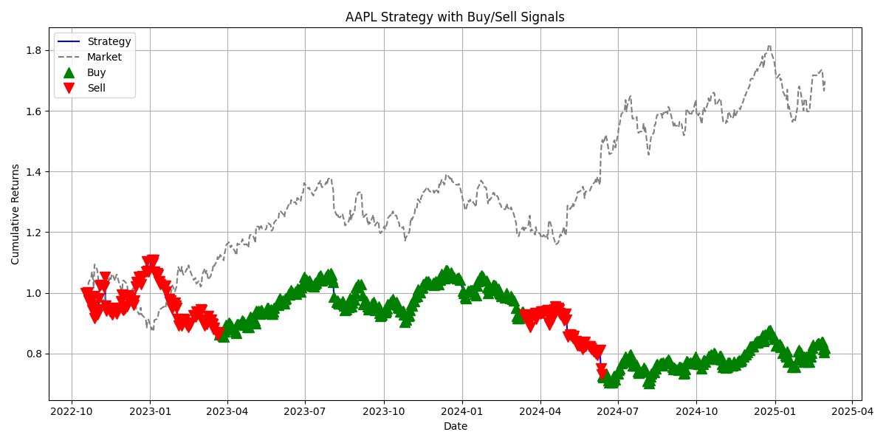

# 📈 Quant Backtester

A modular backtesting engine for evaluating trading strategies using real financial data and machine learning. This project supports both technical indicators and an ML-based prediction model, all through an interactive Streamlit UI.

---

## 🚀 Features

- ✅ Real historical data via `yfinance`
- 🧠 Strategies: SMA, RSI, MACD, Random Forest ML
- 📈 Annotated performance charts (buy/sell signals)
- 📋 Full backtest metrics: Sharpe, CAGR, Calmar, Drawdown, Win %
- 📦 Trade logs for every signal
- 🧰 Multi-ticker batch processing
- 📊 Streamlit UI with strategy selection and visual results
- 💾 Downloadable metrics and logs

---

## 📸 Sample Output



---

## ⚙️ How It Works

1. User selects:
   - Tickers (e.g., AAPL, MSFT)
   - Strategy (SMA, RSI, MACD, ML)
   - Date range

2. System fetches historical data via `yfinance`

3. Strategy logic generates buy/sell signals

4. Backtester simulates returns and calculates metrics

5. Streamlit displays:
   - Strategy performance chart
   - Metrics table
   - Trade log

---

## 🧠 Strategy Logic

- **SMA**: Buy when short MA > long MA
- **RSI**: Buy when RSI < 30, Sell when RSI > 70
- **MACD**: Buy when MACD > signal line
- **ML**: Random Forest predicts next-day movement based on engineered features

---

## 📊 Performance Metrics

| Metric              | Description                          |
|---------------------|--------------------------------------|
| Sharpe Ratio        | Risk-adjusted return (target > 1.5)  |
| CAGR                | Compounded annual growth rate        |
| Max Drawdown        | Largest equity dip                   |
| Calmar Ratio        | CAGR / Drawdown                      |
| Volatility          | Std deviation of strategy returns    |
| Win Rate            | % of profitable trades               |
| Trade Count         | Total number of trades               |

---

## 📦 Run the Streamlit App

```bash
streamlit run streamlit_app.py
```

> Outputs are saved in the `/results/` folder as:
> - `*_pnl_signals.png`
> - `*_trade_log.csv`
> - `metrics.csv`

---

## 📁 Project Structure

```
quant-backtester/
├── backtester.py
├── main.py
├── streamlit_app.py
├── strategies/
│   ├── moving_average.py
│   ├── rsi_strategy.py
│   ├── macd_strategy.py
│   └── ml_strategy.py
├── results/
└── README.md
```

---

## 📬 Author

Built by Dinusanth Surendran as part of my internship-ready project portfolio.  
Feel free to connect or leave feedback!

---

